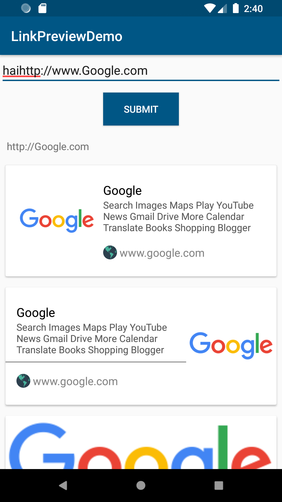
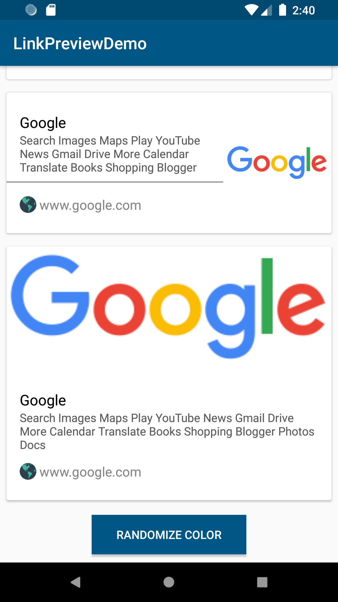

# LinkPreview Generator

This app is for the link preview generator library demo

 

## Steps to run the app

* Clone this repo locally
  ```
  git clone https://github.com/selva27/LinkPreview.git
  ```
* Build and run it on an Android device


## Demo
[Demo.apk](demo/demo.apk)

## How to use
    ```
    app:
    app:lp_url_color=""
    app:lp_description_color
    app:lp_title_color
    app:lp_background_color
    app:lp_image_background_color
    app:lp_with_image="true||false"
    app:lp_style="potrait||classic||material"
    ```
    You can use the lp_style to use any preset style and
    you can switch between three default layouts or you can change the colors
    if you don't want or want image use lp_with_image default (false).

## License
[Apache-2](./LICENSE) license.
